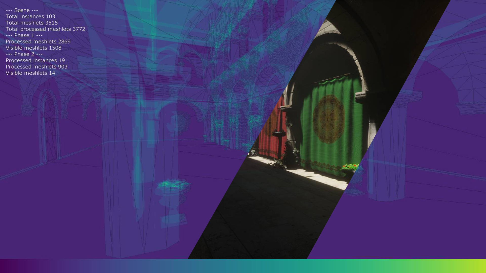
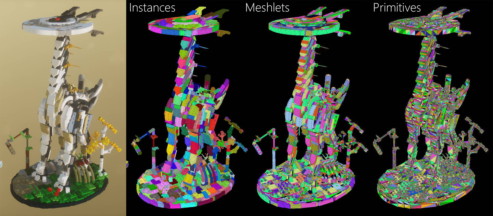
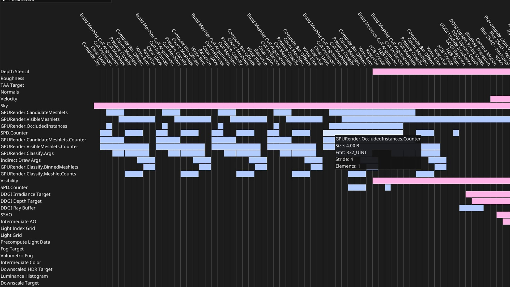
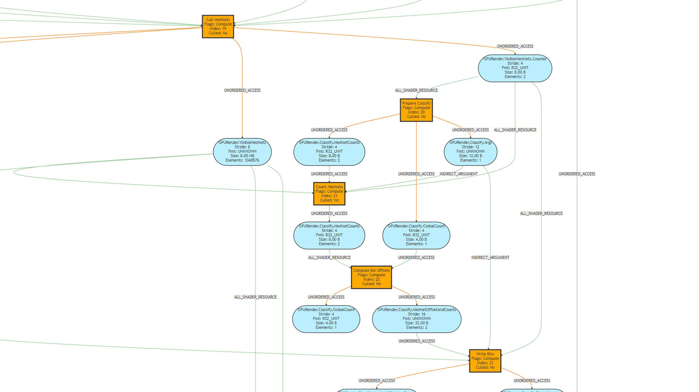
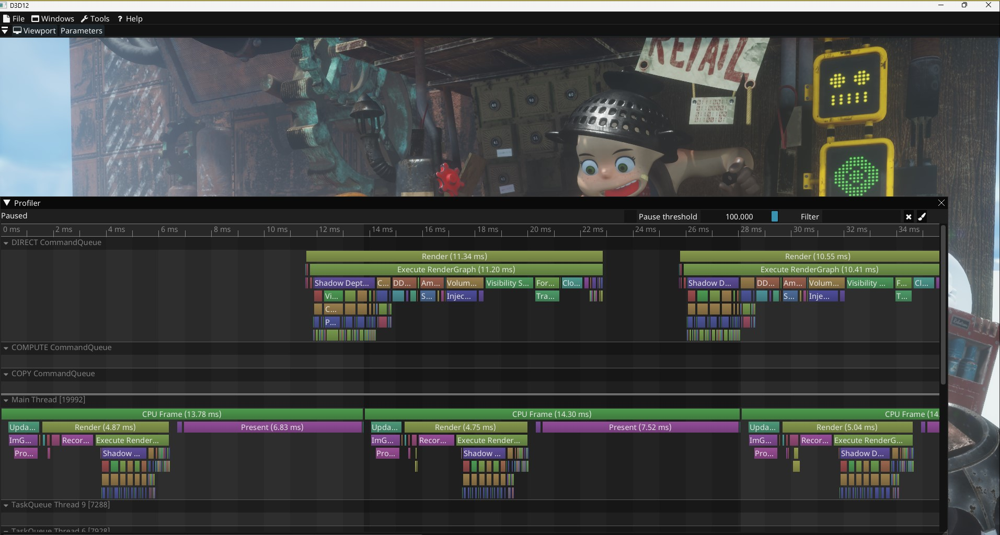

# D3D12 Toy Renderer

This is a personal toy renderer meant as a playground for experimenting with ideas and rendering techniques.

## Requirements

- Visual Studio 2022
- Windows SDK 10.0.19041.0
- DXR compatible GPU with Resource Heap Tier 3 support

## Building

- Run `scripts/Generate_VS2022_Windows.bat` to generate VS project files.
- Open `D3D12.sln` and Compile/Run

## Images

### Visibility Buffer - Deferred Texturing

| 2 Phase Occlusion Culling | Visibility Buffer Deferred Texturing |
|---|---|
|  |  |

GPU Driven rendering with mesh shaders using the 2 Phase Occlusion algorithm to a visibility (ID) buffer. 

### Dynamic Diffuse Global Illumination (DDGI)

| DDGI  | Disabled  |  Path Traced |
|---|---|---|
|   |  |  |
|   |  |  |
|   |  |  |
|   |  |  |

### Render Graph

| Resource re-use | Graph visualization |
|---|---|
|   |   |

### CPU/GPU Profiler

### Tiled and Clustered Light Culling

| View  | Clustered Buckets  |  Tiled Buckets |
|---|---|---|
|   |  |  |

### Volumetric Fog

| Enabled  |  Disabled  |
|---|---|
|   |  |

### Reference path tracer

|   |    ||
|---|---|---|
|   |  | |

### Concurrent Binary Tree - GPU driven runtime subdivision

|   |  |
|---|---|
|   |  |

### Volumetric Clouds

|  |  |
|---|---|
|   |  |

### Cascaded Shadow Maps

| View  | Color Coded Cascades |
|---|---|
|   |  |

### Auto exposure

| View  |
|---|
|   |

## Some noteable features

- GPU driven rendering
- 2 phase occlusion culling
- Render graph
- Deferred texturing
- Path tracing mode
- Tiled light culling (Forward+)
- Clustered light culling (Clustered Forward+)
- Cascaded shadow maps
- Volumetric lighting
- Bindless resources, no input layouts
- Compute particles
- Dynamic eye adaptation
- Screen space reflections (wip)
- Raytraced reflections (wip)
- Screen space ambient occlusion
- Raytraced ambient occlusion (wip)
- Temporal anti-aliasing
- Microfacet BRDF
- Shader hot-reloading
